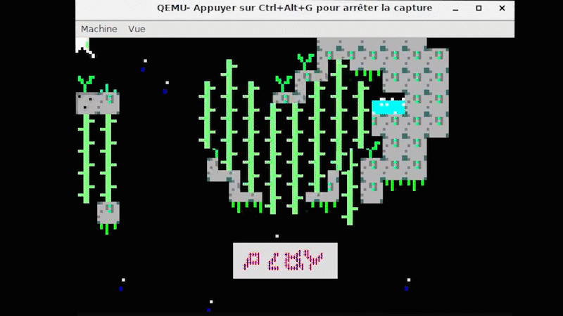

# 86adventure

**X86adventure is a light kernel (bootloader included) for x86-64 microprocessor working in real mode.**

**It provides a graphic library (13h vga mode)  allowing you to:**
**1 : Draw generic shapes ( lines, rectangles, triangles, circles ...)**
**2 : Draw all bitmap format (32bit, 16bit, 8bit indexed-color, monochrome...)**
**3 : Print text with your own bitmap font!**
**4 : Drawing sprites from spritesheet.** 

**The demo includes a realtime map and sprite editors**  
## Making custom spritesheet

## Building level

